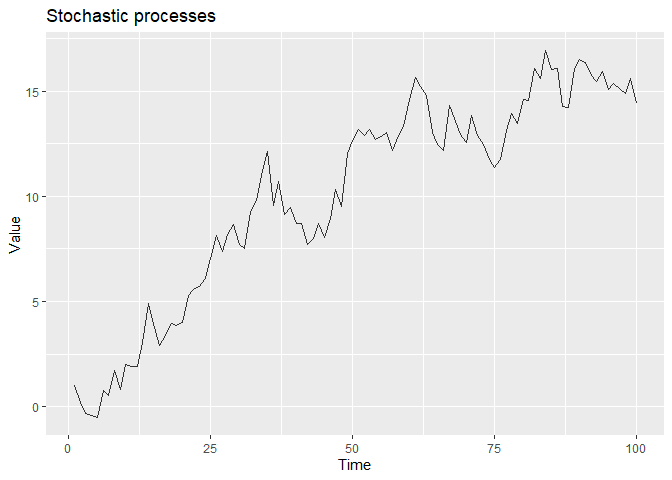
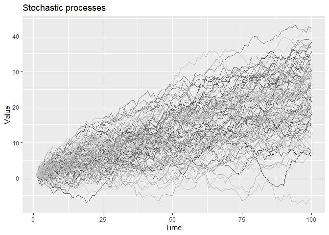

Serie de tiempo vista como Proceso estocástico
----------------------------------------------

Una secuencia de variables aleatorias indexadas {Y\_t} en el tiempo es
llamado proceso estocástico, el cual sirve como un modelo para una serie
de tiempo observada.

En el siguiente código vamos a programar el proceso
*x*(*t*) = *μ* + *x*(*t* − 1) + *ε*(*t*) con número de pasos (nteps) en
forma de columnas y realizaciones (rep) en forma de filas, tal como se
muestra acontinuación:

    nsteps= 100
    rep = 100
    mu <- 0.2;
    x <- matrix(0,ncol=nsteps,nrow=rep );
    x[,1] <- 1

    for(j in 2:nsteps){
      for(i in 1:rep){
          x[i,j] <- mu +  x[i,j-1] + rnorm(1)
      }
    }
    names <- sapply(1:nsteps,function(i) paste('sim.',i,sep=''));
    colnames(x) <- names;

    df <- as.data.frame(x) %>% 
      mutate(rep= as.numeric(1:rep)) %>%
      gather(key='sim',value='valor',-rep) %>%
      mutate(t = as.numeric(substring(sim,5,10))) %>%
      arrange(rep)

Realización del proceso
-----------------------

En la siguiente gráfico podemos observar una realización del proceso

*x*(*t*) = *μ* + *x*(*t* − 1) + *ε*(*t*)

En el siguiente gráfico vamos a observar 100 realizaciones del proceso.

